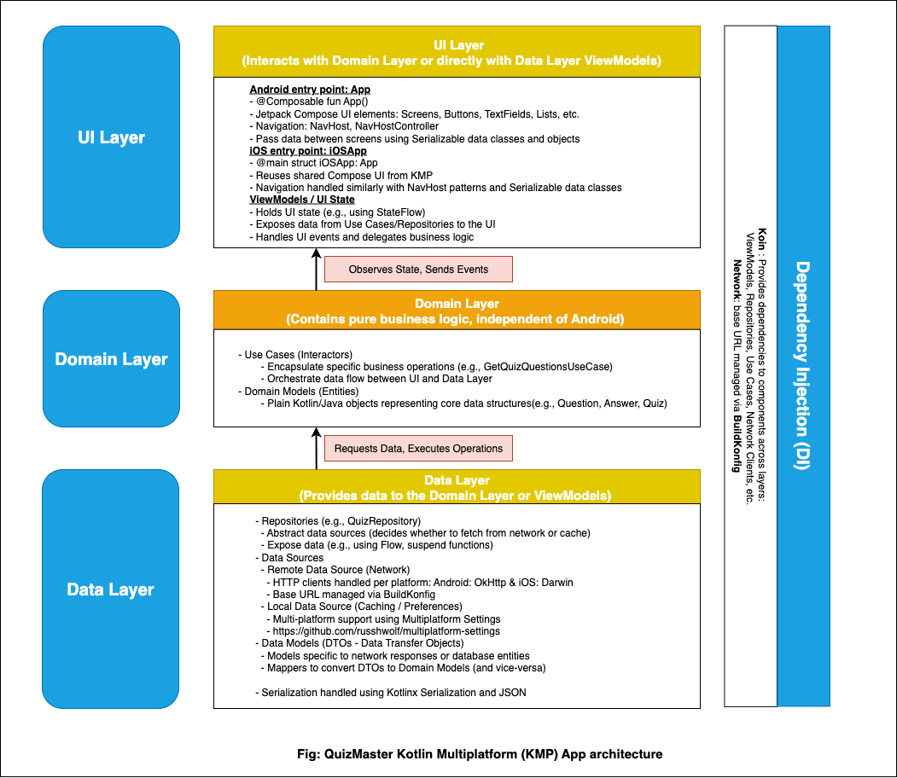

# QuizMaster Kotlin Multiplatform (KMP) App

QuizMaster is an engaging **Kotlin Multiplatform application** built to test your knowledge across various topics. It targets **Android** and **iOS**, sharing most of the business logic and UI with **Compose Multiplatform** while keeping platform-specific entry points.

---

## Project Structure

* **[composeApp](./composeApp/src)** – contains code shared across Android and iOS.

    * **[commonMain](./composeApp/src/commonMain/kotlin)** – platform-independent logic and UI.
    * **[androidMain](./composeApp/src/androidMain/kotlin)** – Android-specific implementations.
    * **[iosMain](./composeApp/src/iosMain/kotlin)** – iOS-specific implementations (e.g., CoreCrypto).
    * **[jvmMain](./composeApp/src/jvmMain/kotlin)** – JVM/desktop-specific implementations.

* **[iosApp](./iosApp/iosApp)** – iOS application entry point.
  Even with Compose Multiplatform UI, you need this for Xcode integration.
  You can also add **SwiftUI** code here if required.

---

## Architecture

This project follows **Clean Architecture** to keep the codebase modular, testable, and scalable. The layers are:

* **UI (Presentation) Layer:**

    * Built with **Compose Multiplatform** for both Android and iOS.
    * Uses **ViewModels** to manage UI state.
    * Navigation handled through **Compose Navigation** abstractions.
    * Fully reactive with **Kotlin Coroutines & Flow**.

* **Domain Layer:**

    * Contains the **business logic** and **use cases** (e.g., fetching questions, submitting answers).
    * Pure Kotlin, no platform dependencies.
    * Uses **domain models** like `Question`, `Answer`, and `Quiz`.

* **Data Layer:**

    * **Repositories** act as the single source of truth.
    * **Remote Data Source:**

        * Uses **Ktor Client** for making network requests to quiz APIs.
        * **kotlinx.serialization** for JSON parsing.
    * **(Planned) Local Data Source:** Room / SQLDelight / DataStore for caching and preferences.
    * **DTOs (Data Transfer Objects)** are mapped to domain models.

* **Dependency Injection:**

    * **Koin** is used for dependency injection across modules.
    * Promotes testability and loose coupling.

---

## Diagram



---

## Core Technologies & Libraries

* **Kotlin Multiplatform** – shared codebase for Android & iOS.
* **Compose Multiplatform** – modern declarative UI across platforms.
* **Kotlinx Coroutines & Flow** – async programming.
* **Koin** – dependency injection.
* **Ktor Client** – network requests.
* **kotlinx.serialization** – JSON serialization/deserialization.
* **AndroidX (for Android target)** – ViewModel, Lifecycle, Navigation.
* **Swift/Xcode (for iOS target)** – iOS integration.

---

## Setup Instructions

1. **Clone the repo (main repo contains KMP project):**

   ```bash
   git clone https://github.com/mrkivan/quiz-app-playground.git
   cd quiz-app-playground/quiz_app_kmp
   ```

2. **Open in IDE:**

    * Open the project in **Android Studio (Giraffe or later)** with KMP support.

3. **Run on Android:**

    * From IDE run config **or**

   ```bash
   ./gradlew :composeApp:assembleDebug   # macOS/Linux
   .\gradlew.bat :composeApp:assembleDebug   # Windows
   ```

4. **Run on iOS:**

    * Open the **/iosApp** folder in Xcode.
    * Run on simulator or device.

---

## References

* [Kotlin Multiplatform Docs](https://kmp.jetbrains.com/templates/)
* [Klibs](https://klibs.io/)
* [Android KMP Codelab](https://developer.android.com/codelabs/kmp-get-started#0)

---
